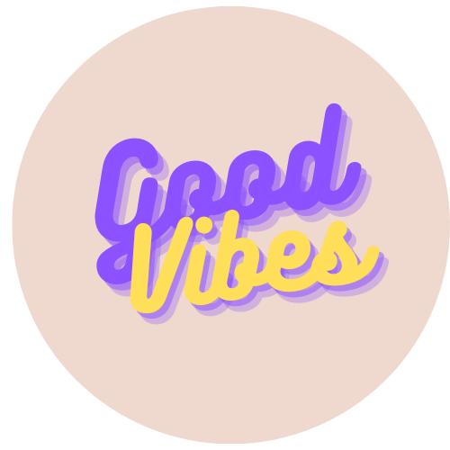

<!-- PROJECT LOGO -->
<br />
<div align="center">
  <a href="https://github.com/AngKS/MLDA-Hackathon-2022">
    
  </a>

<h3 align="center">Good Vibes</h3>

  <p align="center">
    It's okay to be not okay.
    <br />
  </p>

</div>

[](https://app.netlify.com/sites/good-vibes-chat/deploys)


## About the Project

This is a repository for the NTU MLDA 2022 Hackathon Project. The project is a web application that allows users to chat annonymously with other users. A sentiment analysis model is used to detect the sentiment of the user's message and the user's mood is updated accordingly. The user's mood is then used to determine the colour of the chat bubble. The user can also view the mood of other users in the chatroom.

## Hosted locations
- [Web Application](https://good-vibes-chat.netlify.app/)
- [Socket Server (NOT DEPLOYED!!!)]()

## Getting Started

This is an example of how you may start on setting up this project on a local environment. To get a local copy up and running follow these simple example steps.

### Installation

1. Clone the repo
   ```sh
   git clone https://github.com/AngKS/MLDA-Hackathon-2022.git
   ```

2. Install NPM packages
   ```sh
   npm install
   ```
   
## Model Deployment and Model Weights (Sentiment)
 - [Click me to learn more](https://drive.google.com/drive/folders/1npsnXKZCRzuDmLmstCsG_aSh2oBFN8OQ?usp=sharing)

## Acknowledgement

- [Kah Shin](https://github.com/AngKS)
- [TingXiao](https://github.com/tingxiao88)
- [Kritchanat](https://github.com/kritp03)
- [Yu Hoe](https://github.com/TYH71)
- [Choon Wei](https://github.com/choonwei0214)

