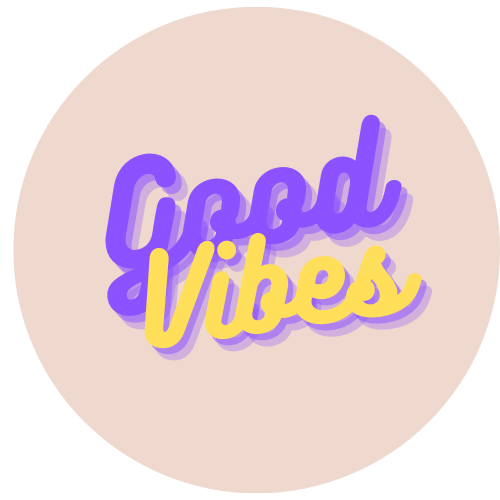

# Good Vibes
>NTU MLDA 2022 Hackathon Project Repository

## Introduction
This is a repository for the NTU MLDA 2022 Hackathon Project. The project is a web application that allows users to chat annonymously with other users. A sentiment analysis model is used to detect the sentiment of the user's message and the user's mood is updated accordingly. The user's mood is then used to determine the colour of the chat bubble. The user can also view the mood of other users in the chatroom.

## Contributors
- [Kah Shin]()
- [TingXiao]()
- [Kritchanat]()
- [Yu Hoe]()
- [Choon Wei]()

